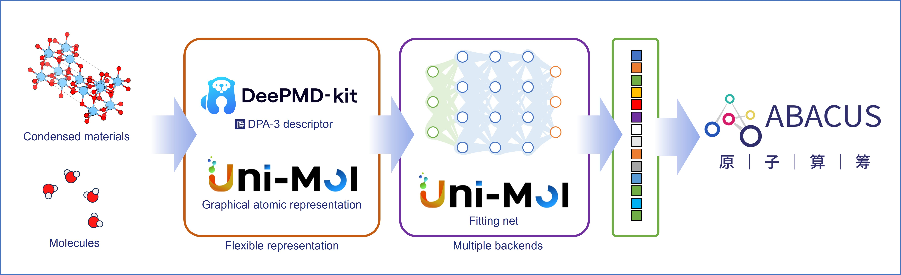

# Uni-Mol-XC



## Introduction

This code interfaces with Uni-Mol, DPA3, and some other neural networks (to be added), and learns properties, such as functional parameters and Hubbard-U values, from geometries.

## Installation

Build the package with the following steps:

1. create virtual environment
2. install dependencies in the order DeePMD-kit (torch backend), then Huggingface, UniMol-Tools, finally this package.

```bash
# create virtual environment
# such as conda
conda create -n mlxc python=3.10

# then activate it
conda activate mlxc

# install dependencies
# export CXX11_ABI_FLAG=1 (consistent with DeePMD-kit)
export CXX11_ABI_FLAG=1
# install PyTorch cpu version
pip install torch torchvision torchaudio --index-url https://download.pytorch.org/whl/cpu
# install DeePMD-kit
pip install git+https://github.com/deepmodeling/deepmd-kit@v3.1.0a0

# install DPData
pip install dpdata

# install Huggingface
pip install huggingface_hub

# install UniMol-Tools
pip install unimol_tools --upgrade

# install this package
pip install .
```

## Unit Test

```bash
# run unit test
bash .github/scripts/ut_driver.sh
```
